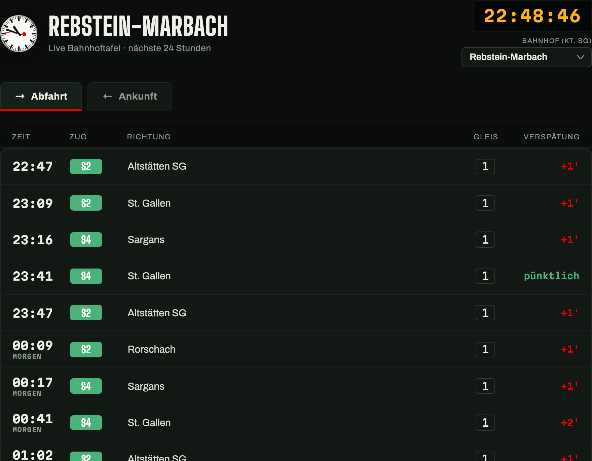
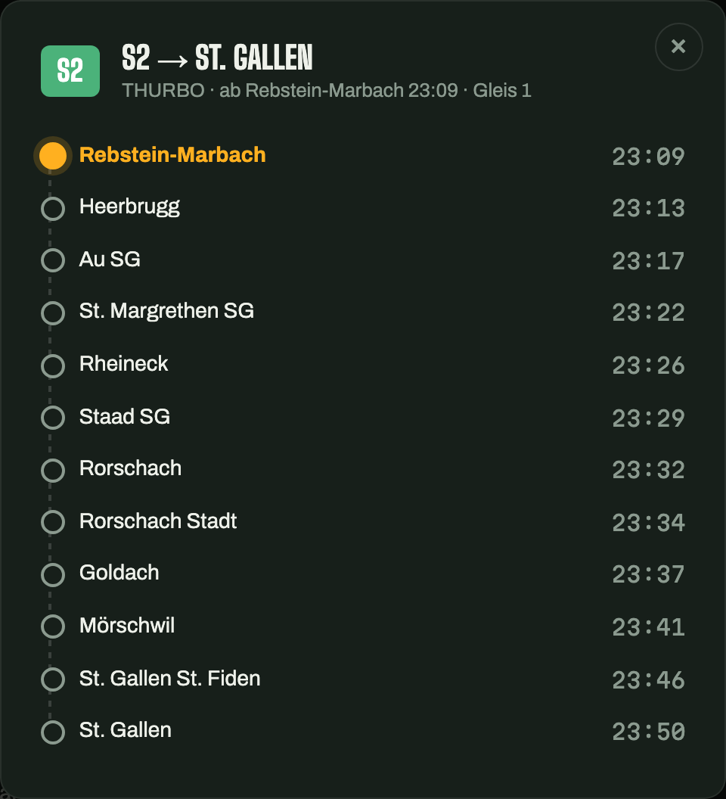

# Bahnhoftafel — Live SBB Abfahrten & Ankünfte

Eine statische Web-Bahnhofstafel im Split-Flap-Look, die Live-Abfahrten und -Ankünfte
für **68 Bahnhöfe im Kanton St. Gallen** anzeigt — direkt aus den offenen SBB-Fahrplandaten,
ohne eigenen Server oder Build-Schritt.

**Live:** <https://helmutqualtinger.github.io/RebsteinBahnhof/>



## Features

- **Live-Abfahrten & -Ankünfte** der nächsten 24 Stunden, alle 30 Sekunden aktualisiert
- **Bahnhofsauswahl** per Dropdown aus allen 68 Zughalten im Kanton St. Gallen
  (Rheintal, Toggenburg, Fürstenland, Linthgebiet, Sarganserland, Zürichsee/Rapperswil,
  St. Gallen-Stadtnetz)
- **Netzplan**: schematische Karte aller 68 Bahnhöfe im Kanton (echte Geokoordinaten,
  entlang der tatsächlichen SBB-/AB-/SOB-Linien verbunden) — Bahnhof direkt anklicken
  statt im Dropdown suchen
- **Fahrplan pro Zug**: Klick auf eine Zeile zeigt alle folgenden Halte mit Zeiten
- **SBB-Bahnhofsuhr** im Original-Design von Hans Hilfiker (1944), als SVG nachgebaut,
  Sekundenzeiger mit rotem "Kelle"-Punkt, sekundengenau
- **Teilen-Buttons** (WhatsApp, X, Facebook, E-Mail) inkl. Open-Graph-Vorschaubild;
  der Link merkt sich den gewählten Bahnhof über `?station=<id>`
- **Hell/Dunkel-Modus** per Knopf umschaltbar, merkt sich die Wahl; ohne Auswahl folgt es
  den Systemeinstellungen
- **In-Memory-Cache** pro Bahnhof/Tab, damit Umschalten ohne Nachladen sofort reagiert
- Läuft komplett im Browser: keine Buildpipeline, kein Backend, kein API-Key



## Tech Stack

Reines HTML/CSS/JavaScript (`index.html`, `style.css`, `app.js`), keine Frameworks,
keine Abhängigkeiten. Schriften via Google Fonts (Big Shoulders Display, Martian Mono,
Archivo). Gehostet als statische Seite über GitHub Pages.

## Datenquelle

Fahrplandaten stammen von [transport.opendata.ch](https://transport.opendata.ch)
(öffentliche, CORS-offene API auf Basis von SBB Open Data / didok). Kein API-Key nötig.

Die Liste der 68 Bahnhöfe wurde nicht von Hand getippt, sondern automatisiert ermittelt:
Fahrpläne mehrerer Regionalzüge wurden nach Haltestellen durchsucht, deren Koordinaten
über die Locations-API geholt und per Punkt-in-Polygon-Test gegen die offizielle
Kantonsgrenze (swisstopo `swissboundaries3d`) gefiltert. Dadurch fallen angrenzende
Kantone (z. B. Herisau AR) korrekt raus, ohne dass man jede Gemeindegrenze auswendig
kennen muss.

## Lokal ausführen

Da die Seite `fetch()` gegen eine externe HTTPS-API macht, reicht ein einfacher
lokaler Server (kein `file://`):

```bash
python3 -m http.server 8787
```

Danach im Browser: <http://localhost:8787/index.html>

## Deploy

Die Seite wird unverändert über **GitHub Pages** vom `main`-Branch ausgeliefert
(Pages-Quelle: Branch `main`, Verzeichnis `/`). Ein Push auf `main` genügt, GitHub Pages
baut automatisch neu.

## Lizenz / Daten

Kein eigener Lizenzanspruch auf die Fahrplandaten. Diese stammen von SBB Open Data
über transport.opendata.ch; Nutzung entsprechend deren Bedingungen.
